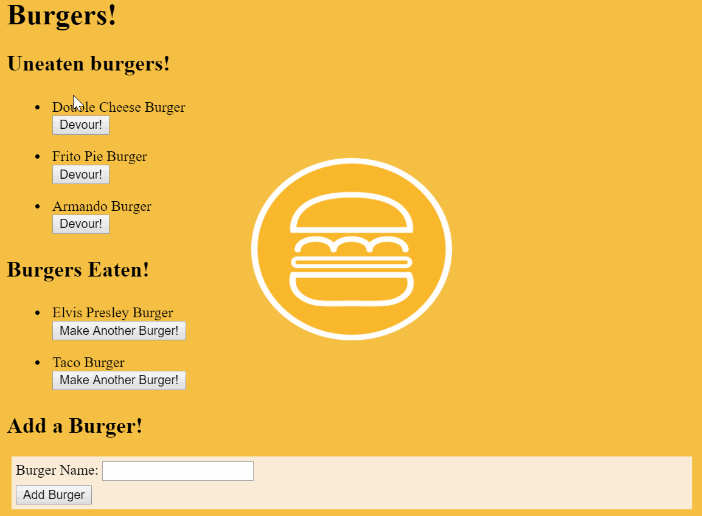
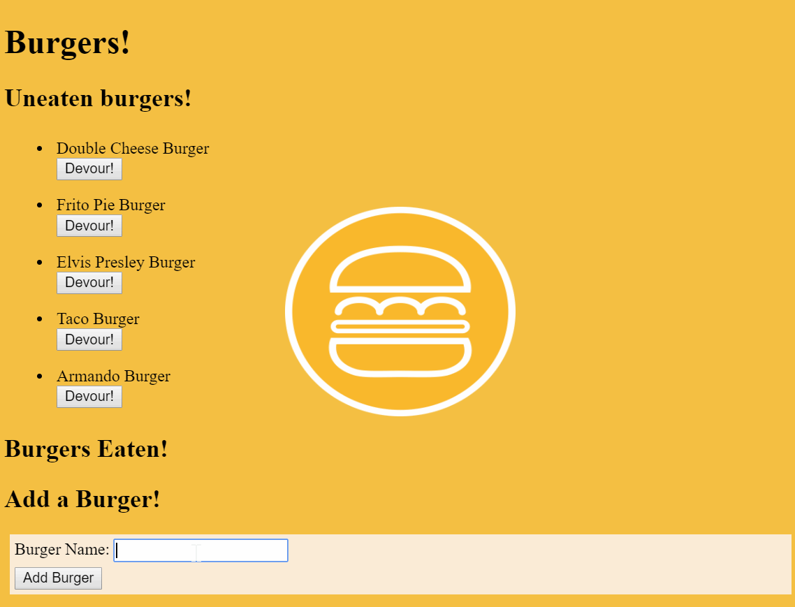

# Eat da burger
Can be found at https://vast-chamber-27999.herokuapp.com/ 

In this app you can eat several default burgers. If that hasn't satisfied your hunger you can choose to make them again. 

If the present burgers don't suit your taste you can add one of your own.

This app was made with the purpose of learning to use mysql workbench as well as the templating tool Handlebars. The default burgers are stored in the mysql database. Their status of devoured is also stored. When a burger is added by a user it is created in the database and its default value is set to false which is not devoured.